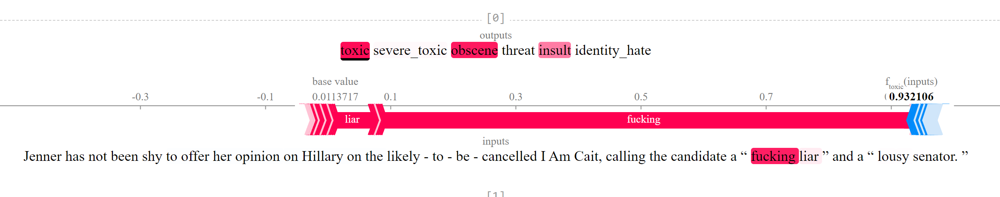

# Project Manual
## Exercise 1
In exercise 1, I trained 2 different models for SemEval Task 1. For paraphrase identification task, I utilized a binary classifier model to detect if given sentence pairs are paraphrase or not. For the similarity task, I 
### Paraphrase Detection
Paraphrase detection model uses pre-trained distilled version of the [RoBERTa-base](https://huggingface.co/distilroberta-base) model. The model uses [distilroberta-base](https://huggingface.co/distilroberta-base) as a cross-encoder and adds a classification head on top to predict the probability of a sentece pair are paraphrase of each other.


#### Train
To train the binary classification model for paraphrase detection, run ```python train_similarity.py```.

### Similarity Model
Similarity model utilizes bi-encoder transformer from pretrained [all-mpnet-base-v2](https://huggingface.co/sentence-transformers/all-mpnet-base-v2) of [Sentence Transformers](https://www.sbert.net/docs/pretrained_models.html#). After encoding both sentences, it minimizes the cosine similarity between sentences given a similarity label.

#### Train
To train the model, run ```python train_similarity.py```.

### Inference
To generate the predictions for the test set, run ```python predict_scores.py```. There are two options to get the scores. If you use ```--only-similarity-model``` flag, it will only use similarity model for predictions. Basically, cosine similarities are considered as the ```is_paraphrase probabilities```.

- The prediction file using only similarity model can be found in ```systemoutputs/PIT2015_transformer_only_similarity_scores.output```
- The prediction file using both models can be found in ```systemoutputs/PIT2015_hybrid_scores.output```


| size_of_test_data | name_of_the_run | F1    | Precision | Recall | Pearson | maxF1 | mPrecision | mRecall |
|-------------------|-----------------|-------|-----------|--------|---------|-------|------------|---------|
| 838               | hybrid     | 0.715 | 0.636     | 0.817  | 0.720   | 0.824 | 0.877      | 0.777   |
| 838               | only_similarity_model_scores     | 0.784 | 0.916     | 0.686  | 0.720   | 0.824 | 0.877      | 0.777   |

As it can be seen from the table, there is a trade-off between precision and recall for paraphrase identification. Hybrid model has better recall and only_similarity model has better precision. However, F1 score encourages only_similarity_model approach.

##Exercise 2
### Scenerio A -- Detoxify and SHAP for User-Generated Content Moderation
#### What is Detoxify?

Detoxify is a pre-trained language model that has been specifically trained to identify and classify toxic language. It is a good choice for Scenerio A user-generated content moderation because it does not require a large dataset of labeled user-generated content to train and computational resources. The model outputs the probability scores for the following classes:
- `toxic`
- `severe_toxic`
- `obscene`
- `threat`
- `insult`
- `identity_hate`   

#### What is SHAP?

SHAP (SHapley Additive exPlanations) is a model explainability tool that can help you to understand how Detoxify is making its decisions. This information can be used to improve the accuracy of the model and to identify any potential biases.

#### How to use Detoxify and SHAP for user-generated content moderation

To showcase how this duo can be used to identify toxic language, I prepared ```Model Explainability.ipynb``` notebook. Here is a possible workflow for using Detoxify and SHAP for user-generated content moderation:

1. Detoxify will identify a variety of classes of toxic language, including hate speech, obscene, vulgar, or profane language, threatening language, harassing or bullying language.
2. SHAP will help  to understand how Detoxify is making its decisions and to identify any potential biases in the model. This will be done buy calculating each words contribution into the propbability scores.




As it can be seen from the screenshot, SHAP identifies which words has more impact on the probability scores. In this example, SHAP identified that "fucking" and "liar" had thee most impact on the 0.93 toxicity score of the sentence "Jenner has not been shy to offer her opinion on Hillary on the likely - to - be - cancelled I Am Cait, calling the candidate a “ fucking liar ” and a “ lousy senator. ”.

### Scenerio B -- Build our own LLM with Instruction Fine-tuning
In the case where I have more time and resources, the best way to accomplish this task would be building my own LLM with instruction fine-tuning and prompt engineering. This would allow us to build a system that is more tailored to the specific needs of the company and its users.

#### Resources Required
***High Quality Data:*** I would first need to collect a dataset of user-generated content that is labeled with the different types of toxic language or abuse that the system should be able to identify. This can be a time-consuming and challenging process, but it is essential for training an accurate and robust model. It should not be only labelled with classifications, the labels should also include few sentence explanations of why this content is problematic given our code of compliance. 
Example prompt for fine-tuning the LLM can be found below:

```
prompt = """

Example 1:

Code of conduct: Bullying and harassment are prohibited. Bullying and harassment are defined as any behavior that is intended to annoy, alarm, abuse, torment, embarrass, or intimidate a person or group of people.
Content: "You're so ugly, no one will ever love you."
Explanation: This content is bullying and harassment, as it is intended to insult and embarrass the recipient. It should therefore be banned.

Example 2:

Code of conduct: Threats of violence are prohibited.
Content: "If you don't do what I say, I'm going to kill you."


Question: Is this content problematic? If yes, for what reasons it should be banned?

"""
```

***Computing power:*** 
***A powerful computing platform:*** Training a large and complex LLM can be computationally expensive. To train your model quickly and efficiently, you will need access to a powerful computing platform, such as a GPU cluster or a cloud computing platform.
***Cloud Computing Services:*** Utilize cloud services such as Amazon Web Services (AWS), Microsoft Azure, or Google Cloud Platform (GCP) for scalability and reliability. Set up virtual machines and containers to run the system components.